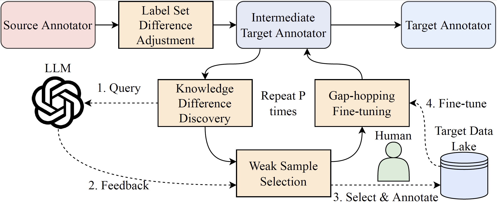

# LakeHopper
This is the repository for the code and data of LakeHopper.



## Install

```console
$ git clone [link to repo]
$ cd Lakehopper
$ pip install -r requirements.txt 
```

If you are using Anaconda, you can create a virtual environment and install all the packages:

```console
$ conda create --name LakeHopper python=3.9
$ conda activate LakeHopper
$ pip install -r requirements.txt
```

## Reproduce the results (DODUO)

In order to reproduce the results for LakeHopper on [DODUO](https://github.com/megagonlabs/doduo/), please follow these steps:

1. Go to [scripts](./scripts) folder 
2. Run the file [lakehopper-on-doduo-p2v.py](./scripts/lakehopper-on-doduo-p2v.py) or [lakehopper-on-doduo-v2s.py](./scripts/lakehopper-on-doduo-v2s.py).
3. Note that you need to set up your own openai.api_base and openai.api_key if you need to query the LLM for verification of the model's annotation performance (an instruction on how to set them can be found [here](https://platform.openai.com/docs/api-reference/audio), in case you are using Azure, please set up openai.api_type, openai.api_base, openai.api_key, openai.api_version parameters and change the generateResponse function model="gpt-3.5-turbo", into engine='gpt-35-turbo'.

## Reproduce the results (Sudowoodo)

In order to reproduce the results for LakeHopper on [Sudowoodo](https://github.com/megagonlabs/sudowoodo/), please follow these steps:

1. Go to [scripts](./scripts) folder 
2. Run the file [lakehopper-on-sudo-p2v.py](./scripts/lakehopper-on-sudo-p2v.py) or [lakehopper-on-sudo-v2s.py](./scripts/lakehopper-on-sudo-v2s.py).
3. Note that you need to set up your own openai.api_base and openai.api_key if you need to query the LLM for verification of the model's annotation performance (an instruction on how to set them can be found [here](https://platform.openai.com/docs/api-reference/audio), in case you are using Azure, please set up openai.api_type, openai.api_base, openai.api_key, openai.api_version parameters and change the generateResponse function model="gpt-3.5-turbo", into engine='gpt-35-turbo'.

## Reproduce the results (RECA)

In order to reproduce the results for LakeHopper on [RECA](https://github.com/ysunbp/RECA-paper/), please follow these steps:

1. Go to [scripts](./scripts) folder 
2. Run the file [lakehopper-on-reca-p2v.py](./scripts/lakehopper-on-reca-p2v.py) or [lakehopper-on-reca-v2s.py](./scripts/lakehopper-on-reca-v2s.py).
3. Note that you need to set up your own openai.api_base and openai.api_key if you need to query the LLM for verification of the model's annotation performance (an instruction on how to set them can be found [here](https://platform.openai.com/docs/api-reference/audio), in case you are using Azure, please set up openai.api_type, openai.api_base, openai.api_key, openai.api_version parameters and change the generateResponse function model="gpt-3.5-turbo", into engine='gpt-35-turbo'.

## Functionality of each folder
1. [scripts](./scripts): used to store all the codes.
2. [checkpoints](./checkpoints): used to store all the checkpoints.
3. [data](./data): used to store all the input datasets and intermediate data.
4. [gpt-logs](./gpt-logs): used to store the response from the GPT API for result analysis purposes.
5. [sampled_data](./sampled_data): used to store the intermediate sampled data generated during the training process.
